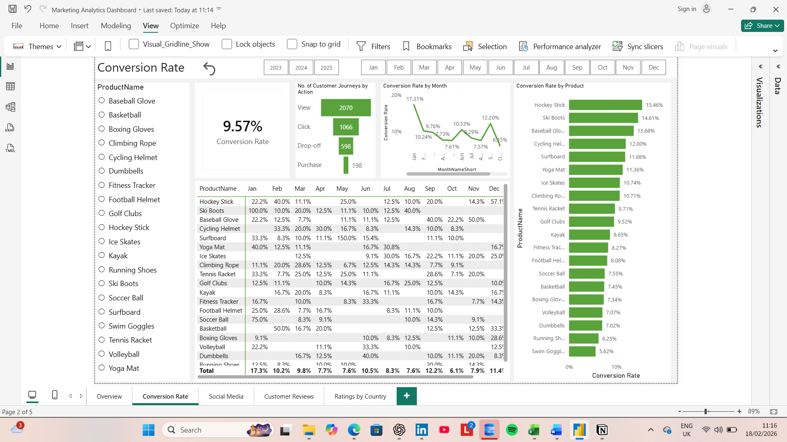
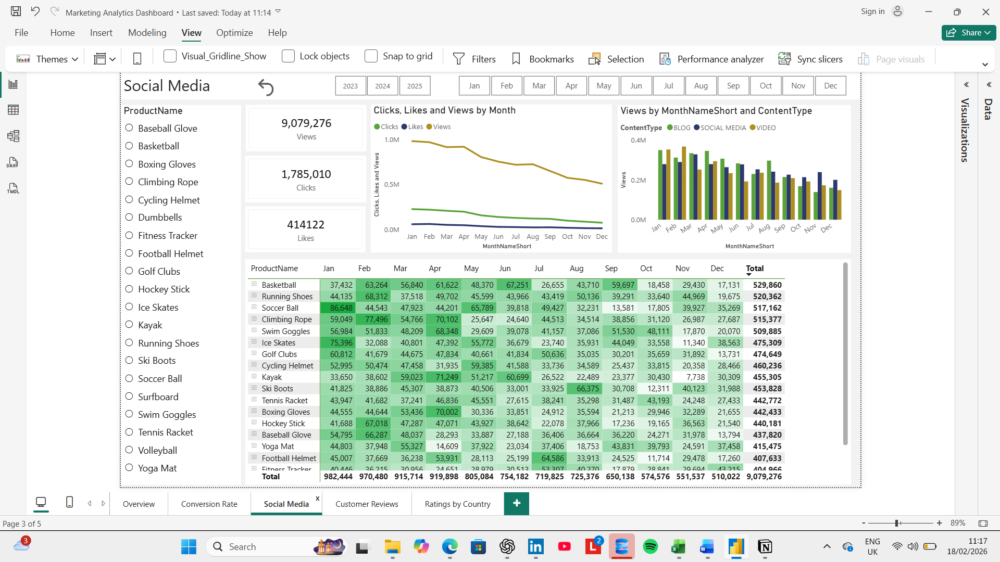
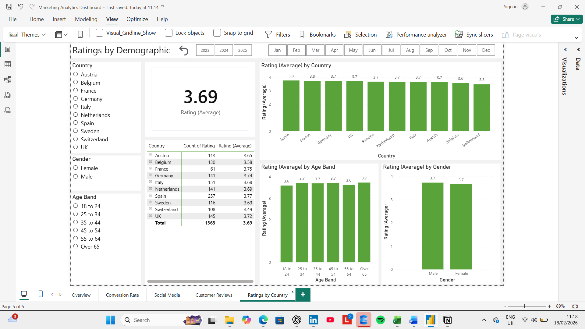

# Marketing Analytics Dashboard (Power BI)
Marketing Dashboard for product conversions, social media and customer reviews

## Overview
This dashboard analyses sales performance across products and time periods. It highlights KPIs such as revenue, conversion rate, social media engagement and customer reviews.

## Features
- Interactive slicers
- DAX measures for conversion rate and average rating calculations
- Conditional formatting
- Funnel analysis

## Screenshots


 

 

 



## SQL Data Preparation

The dataset required cleaning before being imported into Power BI.  
All SQL scripts are available in the `/sql` folder.

### Duplicate Removal (CTE + Window Functions)

```sql
WITH Duplicate_Records AS (
    SELECT
        JourneyID,
        CustomerID,
        ProductID,
        VisitDate,
        Stage,
        Action,
        Duration,
        ROW_NUMBER() OVER (
            PARTITION BY CustomerID, ProductID, VisitDate, Stage, Action
            ORDER BY JourneyID
        ) AS Row_Num
    FROM dbo.customer_journey
)
SELECT *
FROM Duplicate_Records
ORDER BY JourneyID;

### Engagement Data cleaning
- Normalised `ContentType`
- Split combined views/clicks field
- Removed newsletter entries

```sql
SELECT
    EngagementID,
    UPPER(REPLACE(ContentType, 'Socialmedia', 'Social Media')) AS ContentType,
    LEFT(ViewsClicksCombined, CHARINDEX('-', ViewsClicksCombined) - 1) AS Views
FROM dbo.engagement_data;

### Customer Reviews Cleaning
- Removed double spacing in review text
```sql
SELECT
    ReviewID,
    REPLACE(ReviewText, '  ', ' ') AS CleanReviewText
FROM dbo.customer_reviews;
```
### Customer & Product Enrichment
- Joined customers table with geography table
- Created age bands
- Categorised products by price


## Files Included
- 'README.md' - Project documentation

## Tools used
- Power BI Desktop
- Power Query
- DAX
- SQL Server Management Studio
